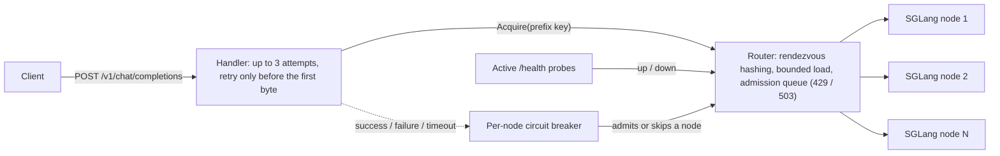
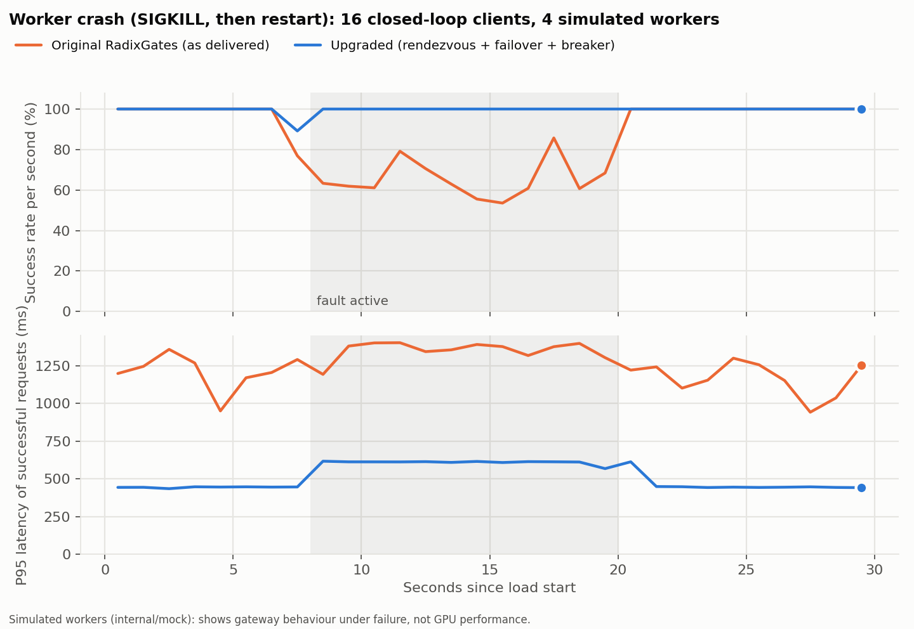
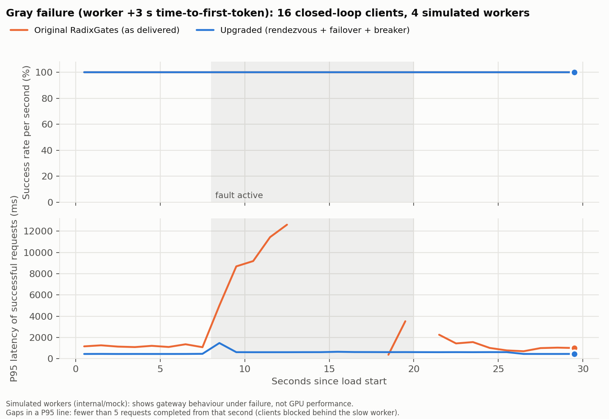
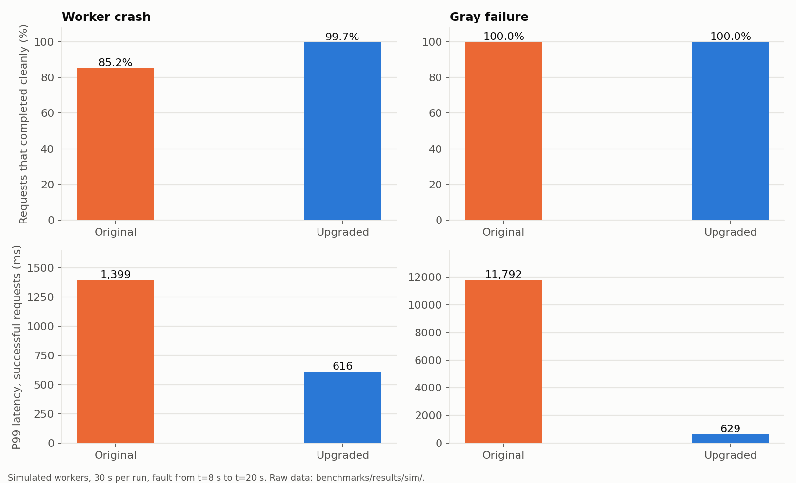

# RadixGates: a failure-tolerant gateway for multi-GPU LLM serving

[](https://github.com/YuchenHe985/radixgates/actions/workflows/ci.yml) 

[Chinese overview](README.zh-CN.md) · English is the primary language for code and technical documentation.

RadixGates is a Go gateway in front of SGLang. It routes each request by its system-prompt prefix so a node's KV cache is reused,
and spreads load across data-parallel replicas and prefill/decode nodes. This repository has three parts: the delivered project,
my multi-GPU evaluation of it on 4x RTX 4090 and 4x A100 machines, and a reliability upgrade (health-aware failover, circuit breaking,
bounded retries, load-aware routing, admission control) measured against the original under injected faults.

- **Routing under node loss.** Losing 1 of 4 nodes remaps **0%** of the surviving nodes' prefix keys (rendezvous hashing), versus **75.3%** with the original `hash % N`.
- **Node crash.** Clean completions **85.2% -> 99.7%**. **Gray failure** (`/health` green, inference hung): P99 **11.8 s -> 0.6 s**. Same config, same load, the original built from tag `upstream-snapshot`.
- **No duplicated output.** A request is retried only before its first byte reaches the client; a stream that breaks mid-way ends with an explicit `upstream_interrupted` event.
- **55 tests under `go test -race`** (54 added): circuit-breaker state machine, routing, active health probes, admission queue, metrics, and handler integration tests against workers that crash, hang, reset connections and fail mid-stream.
- **Real hardware.** The same DP / TP / EP test matrix on 4x RTX 4090 (PCIe) and 4x A100 (NVLink), plus PD disaggregation on the 4090 machine; 8 deployment failures diagnosed or isolated (CUDA image vs driver, removed SGLang flags, NCCL initialisation in Docker, 40 GB OOM, a wedged GPU).



## Why this was built, and in what order

**Starting point.** Running SGLang on several GPU nodes needs something in front that sends a repeated system prompt to the node that already holds its KV cache.
The gateway delivered with this project did that with `FNV-32(system prompt) % N`. I deployed and benchmarked it on two rented multi-GPU machines, and reading it
against what an operator would meet, four things stood out: a dead node kept its share of the traffic and answered `502`; a node that stopped answering held a request
until the client's 10-minute timeout; one popular prompt could pin a node at capacity; and almost nothing showed any of it (three metrics).

**What I changed, in this order.** Failure handling first (active health probes, a per-node circuit breaker, retries only before the first byte so no output is duplicated),
then load (bounded load, an admission queue that answers `429` or `503` with `Retry-After`), then visibility (Prometheus metrics, `/readyz`, `/admin/nodes`). Each change is
measured against the original binary under the same injected faults, not judged by eye.

**The check that changed one of my own rules.** The failure benchmark uses simulated workers. Putting the gateway in front of real llama.cpp servers showed that spilling to the
next node when the preferred one is full, a rule I had added, cut prefix-cache hits from 59% to 24% when each node's cache is small. That led to placement memory and the
affinity wait, and to [a guide for choosing between them](docs/OPERATING.md).

**Who it is for.** Teams running a pool of OpenAI-compatible inference nodes who need failover, cache-aware routing and something to alert on, and who want code small enough
to read and change themselves.

**Deployment boundary.** This is a production-oriented reference gateway, not a public-edge product. It has no built-in authentication, authorization, TLS termination,
tenant quotas, or audit-log sink; request bodies are capped at **4 MiB**, and `/admin/nodes` and `/metrics` expose operational state. Deploy it on a private network behind an authenticated ingress,
restrict the admin and metrics routes, and pin container images/model revisions instead of using `latest`. The gateway accepts both the historical `POST /v1/chat` route and
the standard `POST /v1/chat/completions` route. See [docs/OPERATING.md](docs/OPERATING.md) for the controls that are implemented.

**Provenance.** The original gateway, README and deployment runbooks come from a project my mentor assigned (UnicoreGPU team); the delivered source and README are preserved
immutably at tag [`upstream-snapshot`](https://github.com/YuchenHe985/radixgates/tree/upstream-snapshot), indexed by [docs/UPSTREAM_README.md](docs/UPSTREAM_README.md), and credited in [NOTICE.md](NOTICE.md). Everything after tag `upstream-snapshot`
is mine: `git diff upstream-snapshot`. Order of work: the real-GPU runs came first (2026-07-27, see [data](benchmarks/results/real_gpu/sglang_parallelism_runs.csv)),
then the gateway upgrade and the failure-injection benchmark. Design and failure modes: [docs/RELIABILITY.md](docs/RELIABILITY.md). Running it (alerts, settings, troubleshooting): [docs/OPERATING.md](docs/OPERATING.md).

## Reference scenarios and what was tested

The serving layer is workload-agnostic. It was evaluated against reference scenarios typical of private enterprise deployments
(an internal assistant used by many employees with per-department system prompts, compliance-style analysis on a 32B model,
low-latency financial workloads, MoE serving). Results below are observed in the tested configurations.

| Reference scenario | Configuration | 4x RTX 4090 (PCIe) | 4x A100 (NVLink) |
| --- | --- | --- | --- |
| Many concurrent employees, per-department prompts | DP=4 replicas, prefix-affinity routing, per-node backpressure, Llama-3-8B | 40/40 requests, P50 1.22 s / P95 2.30 s; time to first token 38-62 ms warm vs 87-113 ms cold | 40/40, P50 0.92 s / P95 1.75 s |
| 32B dense model that does not fit one GPU | TP=4, Qwen2.5-32B | 20/20, P50 4.84 s | 20/20, P50 2.75 s |
| MoE model | TP=4 attention + EP=4 experts, Qwen1.5-MoE-A2.7B | 20/20, P50 1.65 s | 20/20, P50 0.85 s |
| Low-latency workloads | 1 prefill + 1 decode GPU (PD disaggregation), Llama-3-8B | 30/30, P50 2.54 s | not run |

The two platforms differ in GPU, memory, SGLang version, driver, container path and, for the 4090 TP/EP runs, NCCL P2P settings, so the
gap between columns is not attributable to interconnect alone ([docs/real-gpu-results.md](docs/real-gpu-results.md)).

## What the original did and what changed

| Area | Original (tag `upstream-snapshot`) | Now |
| --- | --- | --- |
| Routing | `FNV-32(sha256(system prompt)) % N` over all nodes; a node that is down still receives its share | Rendezvous hashing over nodes that are up and whose breaker admits traffic; losing 1 of 4 nodes remaps **0%** of the surviving nodes' keys (**75.3%** with the original scheme) |
| Hot prompts | One department's prompt can pin a node at capacity | Bounded load: a node may exceed the mean by 1.25x (never below 4 concurrent) before requests spill to the next-ranked node |
| Failure | One attempt: dead node -> `502`; stalled node -> the client waits up to the 10-minute timeout | Up to 3 attempts on different nodes, first-token timeout, stall detection; nothing is retried once a byte has reached the client |
| Health | None | Active `/health` probes plus a per-node circuit breaker (closed / open / half-open, exponential cool-down) that also catches nodes whose `/health` is green but whose inference hangs |
| Backpressure | Per-node semaphore, unbounded waiting | Same semaphore, but a bounded admission queue: `429` when full, `503` after `queue_timeout`, both with `Retry-After` |
| Streams that break mid-way | Truncated silently | Client receives an explicit `upstream_interrupted` event; the breaker is charged |
| Observability | 3 metrics, request histogram capped at 1 s | + upstream attempts by node and result, retries by reason, breaker transitions, mid-stream failures, time to first byte, queue wait, per-node up / breaker / in-flight gauges, `/readyz`, `/admin/nodes` |
| HTTP client | A new `http.Client` per request | One shared client with connection pooling |
| Tests | 1 (prefix hash) | 54 more: breaker state machine, router (affinity, remap, bounded load, queue), active health probes, config, metrics, and handler integration tests against fault-injecting workers, all under `go test -race` |
| Config | JSON | Same file works unchanged; new optional `routing`, `reliability`, `admission` blocks |

Config keys, the PD `role` and `group` semantics and the Docker/compose files are unchanged. The legacy `/v1/chat` endpoint remains; `/v1/chat/completions` is an alias for
OpenAI-compatible clients.

## Results

Same config file, same load, four **simulated** SGLang workers (`gateway-go/internal/mock`, a latency model, not GPUs),
16 closed-loop streaming clients, 30 s per run, Apple M1. One node is killed (`SIGKILL`, restarted at t=20 s) or given +3 s
time-to-first-token (gray failure, `/health` stays green) from t=8 s to t=20 s. The "original" binary is built from the
`upstream-snapshot` tag by the benchmark script. Method and caveats: [docs/RELIABILITY.md](docs/RELIABILITY.md).

| Scenario | Phase | Original clean completions | Original P50 / P95 | Upgraded clean completions | Upgraded P50 / P95 |
| --- | --- | ---: | --- | ---: | --- |
| Worker crash | before fault (0-8 s) | 96.8% | 869 / 1,291 ms | 98.9% | 374 / 446 ms |
| | **during fault (8-20 s)** | **64.4%** | 1,209 / 1,393 ms | **100%** | 454 / 614 ms |
| | after restart (20-30 s) | 100% | 825 / 1,207 ms | 100% | 374 / 449 ms |
| Gray failure | before fault | 100% | 897 / 1,240 ms | 100% | 370 / 446 ms |
| | **during fault** | 100% | 446 / **11,792** ms (only 87 requests finished) | 100% | 450 / **621** ms (409 requests) |
| | after | 100% | 594 / 1,425 ms | 100% | 380 / 611 ms |

Phases are by request start time, so requests in flight when the fault begins count as "before fault" (this is why both versions show a few failures in that row).

Whole runs: worker crash, 85.2% (101 x HTTP 502) -> **99.7%** clean; gray failure, P99 11,792 ms -> **629 ms** and 458 -> 1,160 requests served.





Read these numbers carefully:

- **Two effects are mixed in the "before fault" rows.** With this workload's 12 system prompts the original hash puts
  **7 / 4 / 0 / 1** of them on the four nodes, so one node is saturated and one idle before anything fails; bounded-load routing
  spreads them, which is why P50 is about 2x lower with no fault at all. That is a real weakness of `hash % N` with few prompts,
  but it is a load-balancing gain, not a failure-handling gain. The "during fault" rows are where failover and the breaker matter.
- **The 4 remaining failures in the crash run** are streams that were already producing tokens on the killed node. They cannot be
  retried without duplicating output, so they end with an explicit error event (`radixgates_midstream_failures_total` = 4). The breaker
  opened on those failures, so only 1 request needed a retry (`radixgates_retries_total{reason="conn_error"}` = 1).
- In the gray failure the upgraded gateway logged 7 first-token timeouts on the slow node (each request paid one 1 s timeout, max 1.5 s)
  and then diverted traffic although `/health` stayed green: breaker transitions open 3, half-open 3, closed 1.
- The failure scenarios run against simulated workers so that anyone can reproduce them on a laptop in about a minute, with no GPUs and no risk to a
  shared machine. Each cell is one 30 s closed-loop run; the differences are large, and they describe gateway behaviour under failure, not GPU throughput.

Raw data: `benchmarks/results/sim/<scenario>/<original|upgraded>/{requests.csv,summary.json,metrics.prom}`.

## Real inference engines: prefix-cache behaviour under each routing policy

The failure benchmark above uses simulated workers. To see routing against a real engine, `benchmarks/real_engine/run_real.py` starts three
[llama.cpp](https://github.com/ggml-org/llama.cpp) `llama-server` workers (Qwen2.5-0.5B, two slots each, Apple M1) and sends 120 requests that share
six long system prompts (a database schema followed by a question) through each policy, with all KV caches erased before every run. It reads the
number of prompt tokens each request took from the KV cache (`cached_tokens`) and how many prompt tokens each worker evaluated. Median of 3 runs.
This measures how routing changes cache behaviour on a real engine; it is not a GPU benchmark.

**Cache capacity limited to the slots** (`--cache-ram 0`; the working set of six prefixes is as large as the six slots, as when KV memory is the limit):

| Policy | Prompt tokens from cache | Requests/s | Latency p50 / p95 | Share of prefill work on the busiest worker |
| --- | ---: | ---: | --- | ---: |
| original (`hash % N`, queues when the node is full) | 59.1% | 3.13 | 1.70 / 4.53 s | 73% |
| upgraded, spills to the next node when full | 24.4% | 1.80 | 3.08 / 5.25 s | 44% |
| upgraded + placement memory + affinity wait (10 s) | 61.5% | 3.40 | 1.52 / 5.07 s | 43% |
| round-robin, no gateway | 22.0% | 1.68 | 3.36 / 6.40 s | 35% |

**llama.cpp's default** keeps evicted prompts in a host-memory cache (`--cache-ram`, 8 GiB), so any worker can restore any prefix cheaply. Every policy
then reaches 95-98% cache hits and the differences are small (requests/s: original 9.3, upgraded 10.8, upgraded + placement + wait 10.6, round-robin 9.6).

What this showed:

- **Spilling when the preferred node is full is wrong when a cache holds few prefixes.** The upgraded gateway's original rule sent a request to the
  next-ranked node the moment its preferred node was full, which scatters one prefix over several nodes and evicts it everywhere: 24% cache hits
  against 59% for the original, which queues. The original does not balance load either: three quarters of the prefill work landed on one worker,
  because six prompts hashed onto three nodes unevenly.
- **Placement memory (`routing.placement_size`)** sends a new prefix to the node holding the fewest prefixes and keeps it there until that node is down,
  which removes the hash skew. **`routing.affinity_wait`** makes a request wait for a full preferred node instead of spilling. Together they reach the
  original's cache hit rate (61.5% median; runs 61.5%, 60.6% and 68.5% against 62.2%, 59.1% and 58.3% for the original, so the two are
  indistinguishable here) while spreading the work. Either one alone did not: placement without waiting gave 19.7%, waiting without placement 45.7%
  with one worker idle.
- **Limits.** One machine, three runs, a 0.5B model whose prefill is slow because three servers share one GPU, and six prefixes. Whether waiting beats
  spilling depends on the ratio of a cache miss to queueing time; with a fast prefill on a large GPU the balance shifts toward spilling. Both options
  are off by default (`placement_size` 0, `affinity_wait` 0), so existing configs behave as before.

Raw data: `benchmarks/results/real_engine_limited_cache/` and `real_engine_default_cache/`.

## My multi-GPU evaluation of the original (real hardware)

Before the changes above I ran the delivered RadixGates on rented 4x RTX 4090 (PCIe) and 4x A100-SXM4-40GB (NVLink) machines in DP=4,
TP=4, EP=4 and PD modes and diagnosed the failures that came up (CUDA image vs driver, removed SGLang flags, NCCL initialisation, 40 GB OOM,
a wedged GPU). Highlights: 4090 DP=4, Llama-3-8B, 40 concurrent requests, 40/40 succeeded, P50 1,215 ms / P95 2,300 ms, repeated-prefix time
to first token 38-62 ms warm vs 87-113 ms cold; A100 TP=4 P50 2,754 ms and EP=4 846 ms against 4,836 ms and 1,653 ms on the 4090 box, which is
**not** a clean NVLink-vs-PCIe comparison (different SGLang version, driver, deployment, and NCCL P2P disabled on the 4090 TP/EP runs).
Data and caveats: [docs/real-gpu-results.md](docs/real-gpu-results.md); deployment reports: [`4× RTX 4090`](docs/deployment-reports/rtx-4090.md), [`4× A100-SXM4`](docs/deployment-reports/a100-sxm4.md).
The companion tool [llm-serving-eval-kit](https://github.com/YuchenHe985/llm-serving-eval-kit) turns those findings into a sizing estimator, a log
diagnoser and a confounder-aware benchmark comparison.

## Try it

```bash
make test                                       # vet + 55 tests under -race
make bench                                      # original vs upgraded, crash and gray failure, ~2 min (needs go, curl, python3)
make plots                                      # needs matplotlib

# run against real SGLang nodes, unchanged from the original docs
docker compose -f docker-compose.dp.yml up -d
curl localhost:8080/readyz ; curl localhost:8080/admin/nodes ; curl localhost:8080/metrics | grep radixgates_
```

The compose files retain the upstream `latest` defaults for compatibility. Set explicit image tags or digests before treating a deployment as reproducible.

Optional config (defaults shown; everything is optional):

```json
{
  "routing":     { "bounded_load_factor": 1.25, "affinity_floor": 4, "affinity_wait": "0s", "placement_size": 0 },
  "reliability": { "max_attempts": 3, "attempt_timeout": "15s", "stream_idle_timeout": "30s",
                   "breaker": { "enabled": true, "failure_threshold": 5, "open_duration": "5s" },
                   "health":  { "enabled": true, "interval": "2s", "path": "/health" } },
  "admission":   { "max_queue": 128, "queue_timeout": "10s" }
}
```
