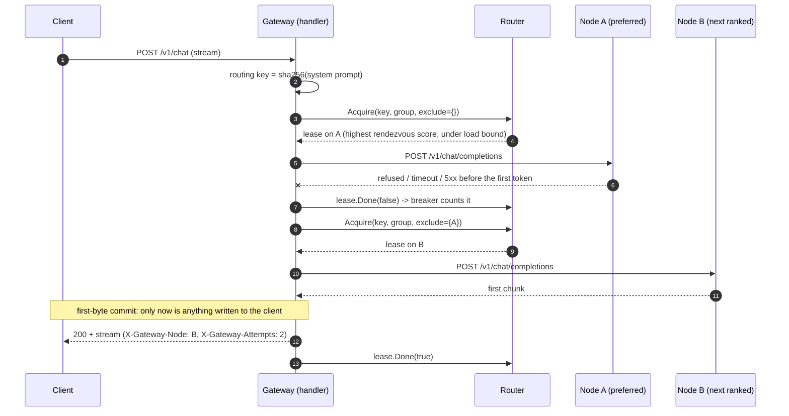

# Reliability design

## Request lifecycle

## Decisions

- **Rendezvous hashing.** SGLang's radix cache makes a repeated prefix cheap on the node that has it, so the same system prompt should keep
  landing on the same node. `hash % N` remaps about three quarters of all keys when one of four nodes is lost (75.3% measured with the original
  formula in `router_test.go`), discarding warm caches on healthy nodes. Rendezvous ranking moves only the lost node's keys.
- **Bounded load.** A node may hold at most `ceil(bounded_load_factor x (in-flight + 1) / candidates)` requests (never below `affinity_floor`);
  beyond that a request spills to the next-ranked node. A cache miss is usually cheaper than queueing behind a saturated GPU. The floor keeps
  affinity at low traffic, where the bound would otherwise be 1. A node that is merely at its concurrency limit also spills unless
  `affinity_wait` is set, see below.
- **Affinity wait.** With `routing.affinity_wait` set, a request whose preferred node is full (but not over the bound) waits for it, up to that
  long, before spilling. The wait counts against the bounded admission queue and its timeout, and a node that is down or over the bound is never
  waited for. Measured on real llama.cpp workers with a small cache, spilling at once cut prefix-cache hits from 59% to 24%
  ([README](../README.md#real-inference-engines-prefix-cache-behaviour-under-each-routing-policy)).
- **Placement memory.** With `routing.placement_size` set, the router remembers which node each (group, prefix) is placed on. A new prefix goes to the
  node holding the fewest prefixes (then the fewest in flight, then the best rendezvous rank), and stays there until that node is unavailable, when it
  moves once and does not return on recovery. A retry that excludes the placed node uses another node without moving the placement, and a spill
  does not move it either. Least recently used prefixes are forgotten beyond the size. This avoids the skew of hashing a few hot prefixes onto a few nodes.
- **First-byte commit.** A retry is only safe while the client has received nothing, so the handler reads the first upstream chunk before writing
  any header or byte. Before that point: refused connection, first-token timeout, 5xx, or a stream that dies with no output are retried on
  another node. After it: the client gets `upstream_interrupted` and the breaker is charged; a non-SSE body is aborted so a truncated response
  cannot look complete.
- **What counts against a node.** Connection errors, first-token timeouts, stalled streams and HTTP 500/502/503/504. HTTP 429 (node busy) is
  retried elsewhere without charge; other 4xx are the caller's fault and pass through; a client cancel releases the slot with no verdict.
- **Two detectors.** Active `/health` probes remove a node before traffic reaches it. The passive breaker catches what a health endpoint misses.
- **Stale results.** `Allow()` returns a ticket stamped with the breaker generation; a slow request that started before the breaker tripped
  cannot close it by finishing successfully. Only the half-open probe can.

## Compatibility notes

The `/v1/chat` request schema, `/health`, `/metrics`, config keys, `group` / `role` semantics and the compose files are unchanged. Two small behaviour
differences: SSE bytes are forwarded exactly as SGLang sends them instead of being re-framed line by line, and the `sglang_error` outcome label of
`radixgates_requests_total` is now `upstream_failed` (reported after retries).

## Failure modes

| Failure | Detected by | Action | Client sees | Metric |
| --- | --- | --- | --- | --- |
| Node dead (connection refused) | attempt error | retry on next-ranked node; breaker counts it | 200, `X-Gateway-Attempts: 2` | `upstream_attempts_total{result="conn_error"}`, `breaker_transitions_total{to="open"}` |
| Node answers 5xx | HTTP status | same | 200 | `result="http_5xx"` |
| Node accepts but never answers | first-token timer | cancel, retry elsewhere | 200 after ~`attempt_timeout` | `result="timeout"` |
| Slow but `/health` green | first-token timeouts | retries, then breaker opens and diverts traffic | brief latency bump, then normal | `result="timeout"` |
| `/health` failing, inference still works | active probes | node marked down, not selected | 200 | `radixgates_node_up` = 0 |
| Node busy (429) | HTTP status | retry elsewhere, breaker not charged | 200 | `result="busy"` |
| Stream dies after output started | read error / idle timeout | no retry; error event; breaker charged | partial output + error event | `midstream_failures_total` |
| Every node unavailable | empty candidate set | fail fast | 503 + `Retry-After` | `requests_total{status="no_node"}`; `/readyz` 503 |
| All attempts failed | attempt loop | give up | 502 + `Retry-After` | `status="upstream_failed"` |
| All nodes at capacity | router | wait in bounded queue | higher latency | `queue_wait_seconds`, `queue_depth` |
| Queue full / wait too long | router | reject | 429 / 503 + `Retry-After` | `status="queue_full"` / `"queue_timeout"` |
| Client disconnects | request context | cancel upstream, release slot | n/a | `result="canceled"` |

Covered by `gateway-go/handler/direct_test.go` and `gateway-go/router/router_test.go`.

## Benchmark method

`benchmarks/scripts/run_sim.sh` builds the original gateway from the `upstream-snapshot` tag and the upgraded gateway from the working tree,
starts four simulated workers (time to first token 100 ms cold / 50 ms warm, 15 ms per token, 16 tokens, full speed up to 4 concurrent requests,
4-prefix cache), and drives both with the same config file and 16 closed-loop clients choosing uniformly among 12 system prompts. A request counts as
clean only if it returned 200, streamed a token, ended with `data: [DONE]` and had no error event. Latencies are over clean requests; failures are
reported separately. Limits: one 30 s run per cell, a closed loop (slow requests throttle offered load, which is why the original serves fewer requests
in the gray-failure run), and simulated workers that cannot show GPU effects such as memory pressure or NCCL stalls. The 12-prompt workload happens to hash
7/4/0/1 onto four nodes under the original scheme; other prompt sets will balance differently.
